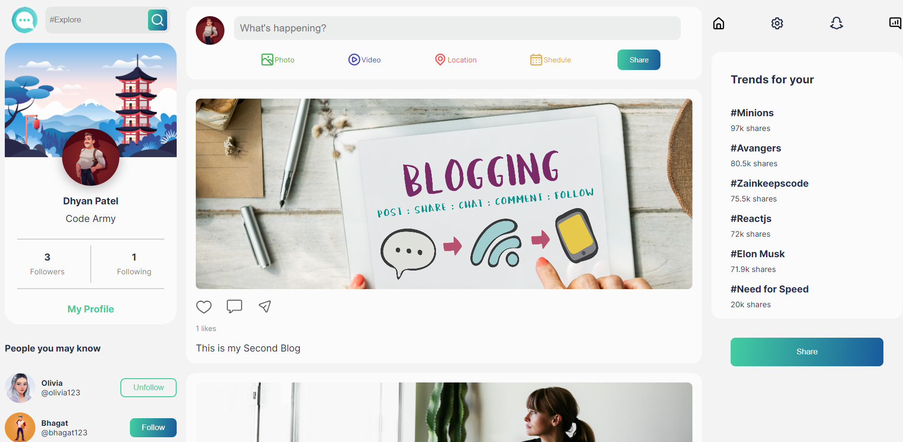

# Social Media 
Social Media App Provide to Upload Blogs and like that blogs also. We can follow different people and chat with them.

# Snapshot



# Demo

[Social-Media - Live ◀️](https://social-media-dhyanpatel110.vercel.app/)


## Project setup

### Clone this repo

```
git clone https://github.com/dhyanpatel110/Social-Media-Client.git

```

### Install dependencies

```
npm install
```

### Compiles and hot-reloads for development

```
npm run start
```

### Compiles and minifies for production

```
npm run build
```

### Lints and fixes files

```
npm run lint
```
